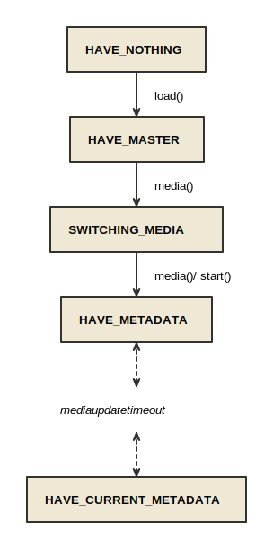

# Playlist Loader

## Purpose

The [PlaylistLoader][pl] (PL) is responsible for requesting m3u8s, parsing them and keeping track of the media "playlists" associated with the manifest. The [PL] is used with a [SegmentLoader] to load ts or fmp4 fragments from an HLS source.

## Basic Responsibilities

1. To request an m3u8.
2. To parse a m3u8 into a format [videojs-http-streaming][vhs] can understand.
3. To allow selection of a specific media stream.
4. To refresh a live master m3u8 for changes.

## Design

### States

- `HAVE_NOTHING` the state before the m3u8 is received and parsed.
- `HAVE_MASTER` the state before a media manifest is parsed and setup but after the master manifest has been parsed and setup.
- `HAVE_METADATA` the state after a media stream is setup.
- `SWITCHING_MEDIA` the intermediary state we go though while changing to a newly selected media playlist
- `HAVE_CURRENT_METADATA`  a temporary state after requesting a refresh of the live manifest and before receiving the update

### API

- `load()` this will either start or kick the loader during playback.
- `start()` this will start the [PL] and request the m3u8.
- `media()` this will return the currently active media stream or set a new active media stream.

### Events

- `loadedplaylist` signals the setup of a master playlist, representing the HLS source as a whole, from the m3u8; or a media playlist, representing a media stream.
- `loadedmetadata` signals initial setup of a media stream.
- `playlistunchanged` signals that no changes have been made to a m3u8.
- `mediaupdatetimeout` signals that a live m3u8 and media stream must be refreshed.
- `mediachanging` signals that the currently active media stream is going to be changed.
- `mediachange` signals that the new media stream has been updated.

[pl]: ../src/playlist-loader.js
[sl]: ../src/segment-loader.js
[vhs]: intro.md
